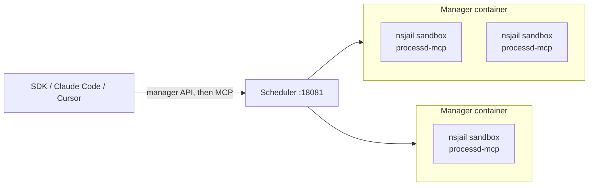
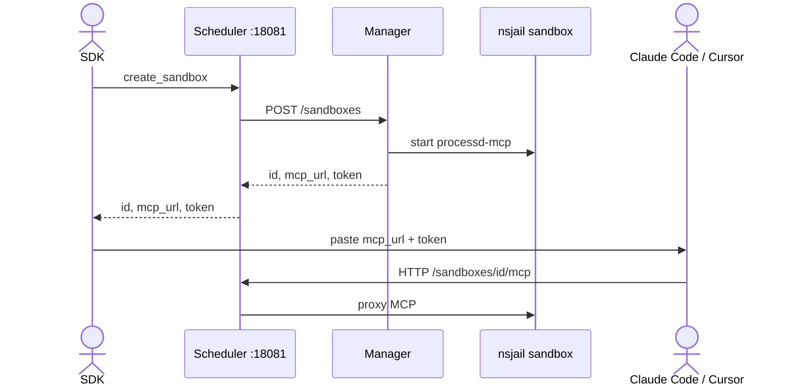

Use this when you want a **fleet of isolated workspaces**, not MCP on the host itself.

A sandbox is **not** a Docker container. It is an nsjail jail **inside** a manager container. You cannot point Claude Code or Cursor at the scheduler (or manager) `/mcp` — that path does not exist. Create a sandbox first, then connect MCP to the returned `mcp_url`.

## Architecture



| Layer | What it is | What it is not |
| --- | --- | --- |
| **Scheduler** | HTTP front on `:18081`. Same API as a manager. Discovers manager nodes, places new sandboxes, and routes later calls using a signed sandbox id. | Not a sandbox runtime. Does not run `processd-mcp`. Has no `/mcp`. |
| **Manager container** | One Docker/K8s container running `processd-sandbox-manager`. Image also ships `nsjail`, `pasta`, `processd-scheduler`, and the `processd-mcp` binary. | Not one-container-per-agent. Not an MCP server you connect a client to. |
| **Sandbox** | Created **inside** that manager on `POST /sandboxes`: nsjail namespaces + cgroup, a `processd-mcp` worker, a workspace. MCP is proxied as `http://<scheduler>/sandboxes/<id>/mcp`. | Not a new Docker container. No Docker socket. |

Store sandbox ids **opaque** — they encode which manager owns the jail.

You need Docker with **cgroup v2** writable. Linux hosts work; Docker Desktop for macOS cannot use `network_mode: host`.

## Start

Same overlay as the repo's VS Code task `core:docker:up-manager(scheduler)`: manager compose, required-cgroup overlay, scheduler overlay. Scheduler reads `./scheduler-config.local.yaml`. Talk to **`:18081`**.

```bash
for f in compose.manager.yaml compose.manager.cgroup.yaml compose.manager.scheduler.yaml scheduler-config.local.yaml; do
  curl -LO "https://daimon-hq.github.io/scripts/$f"
done

PROCESSD_MANAGER_LIMITS_MODE=required docker compose \
  -p processd-local \
  -f compose.manager.yaml \
  -f compose.manager.cgroup.yaml \
  -f compose.manager.scheduler.yaml \
  up -d --force-recreate processd-sandbox-manager processd-scheduler

curl -i http://127.0.0.1:18081/health
```

Files on this site: [compose.manager.yaml](/scripts/compose.manager.yaml), [compose.manager.cgroup.yaml](/scripts/compose.manager.cgroup.yaml), [compose.manager.scheduler.yaml](/scripts/compose.manager.scheduler.yaml), [scheduler-config.local.yaml](/scripts/scheduler-config.local.yaml). They match `core/` except the image is `ghcr.io/daimon-hq/processd-sandbox-manager:latest` (manager, scheduler, `processd-mcp`, `nsjail`, and tools such as `bash`, `python3`, `node`, `git`, `rg`).

<Callout type="warn" title="Docker permissions">
  The cgroup overlay needs `/sys/fs/cgroup` mounted writable plus `SYS_ADMIN`, `SETUID`, `SETGID`, `SETFCAP`, and `DAC_OVERRIDE`. If creation fails with a cgroup `Permission denied`, your Docker host cannot delegate cgroup v2 — use a Linux host.
</Callout>

## Create a sandbox, then connect MCP

Scheduler and manager only speak the **manager HTTP API** (`/health`, `/sandboxes`, …). They do not expose `/mcp`. A Claude Code / Cursor config aimed at `http://127.0.0.1:18081/mcp` will fail.



1. Call `create_sandbox` (SDK or `POST /sandboxes` on `:18081`).
2. Read `mcp_url` and `token` from the response.
3. Put those into the MCP client. Keep the sandbox alive — do not delete it while the client is connected.

```bash
pip install daimon-sdk
```

```python
import asyncio
from daimon_sdk import DaimonManagerClient

async def main() -> None:
    async with DaimonManagerClient("http://127.0.0.1:18081") as manager:
        sandbox = await manager.create_sandbox()
        print(sandbox.info.mcp_url)
        print(sandbox.info.token)

asyncio.run(main())
```

`mcp_url` looks like `http://127.0.0.1:18081/sandboxes/<id>/mcp`. Paste it into Claude Code (`.mcp.json`) or Cursor:

```json
{
  "mcpServers": {
    "daimon": {
      "type": "http",
      "url": "http://127.0.0.1:18081/sandboxes/<id>/mcp",
      "headers": {
        "X-Access-Token": "<sandbox token>"
      }
    }
  }
}
```

Use the **sandbox** token, not a manager token. For text-only clients, append `/text-only` to the path (`.../mcp/text-only`). Full client notes: [Connect](/connect).

To drive the sandbox from Python instead of an MCP client, keep the SDK session:

```python
import asyncio
from daimon_sdk import DaimonManagerClient

async def main() -> None:
    async with DaimonManagerClient("http://127.0.0.1:18081") as manager:
        async with manager.sandbox() as sandbox:
            runtime = await sandbox.runtime.get_context()
            print(runtime.base_workdir)
            result = await sandbox.exec.bash("python3 --version")
            print(result.display_text)

asyncio.run(main())
```

That context manager already talks MCP for you and deletes the sandbox on exit.

## Reach sandboxes from your LAN

Set `public_base_url` in `scheduler-config.local.yaml` to the host's real LAN IP (or Tailscale IP). **Do not** use `0.0.0.0` in URLs you hand to clients.

```yaml
public_base_url: http://192.168.1.100:18081
```

Then recreate with the same overlay:

```bash
PROCESSD_MANAGER_PUBLIC_MCP_HOST=192.168.1.100 \
PROCESSD_MANAGER_LIMITS_MODE=required docker compose \
  -p processd-local \
  -f compose.manager.yaml \
  -f compose.manager.cgroup.yaml \
  -f compose.manager.scheduler.yaml \
  up -d --force-recreate processd-sandbox-manager processd-scheduler
```

Manager env vars: [Configuration](/config#manager).
